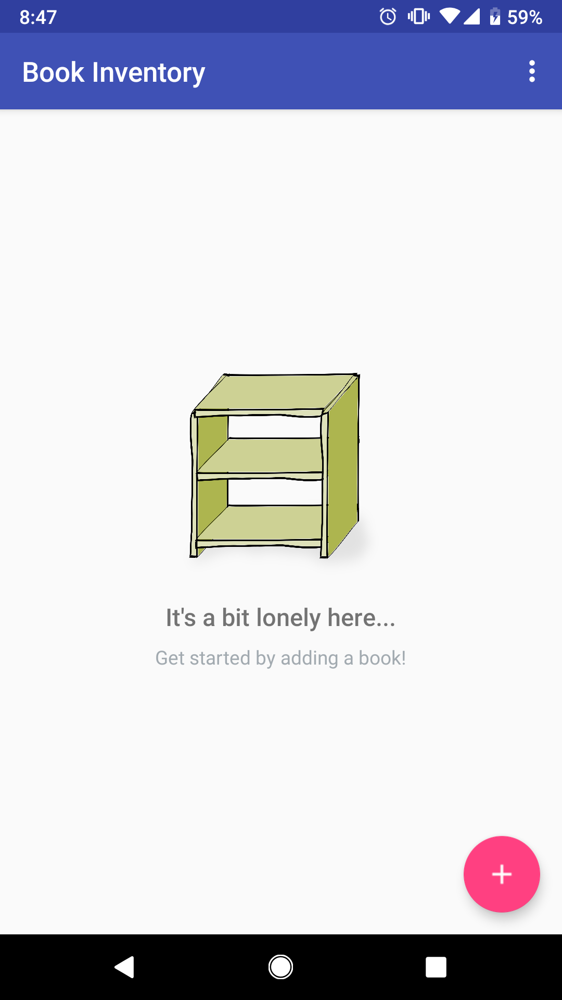
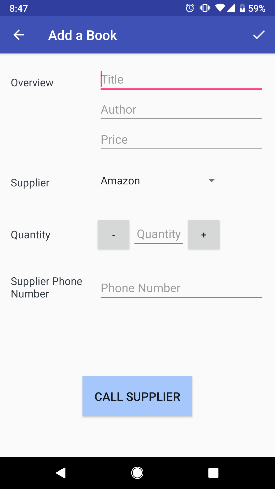
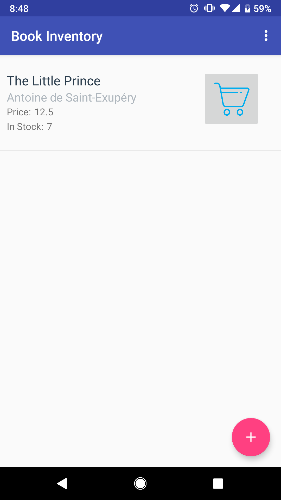
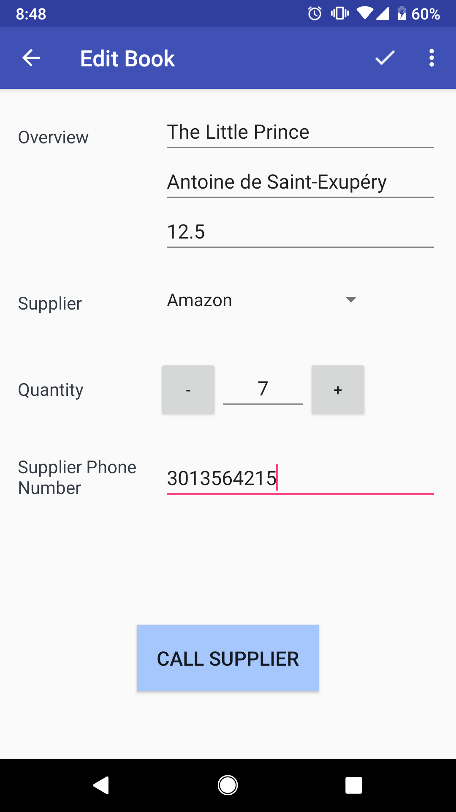
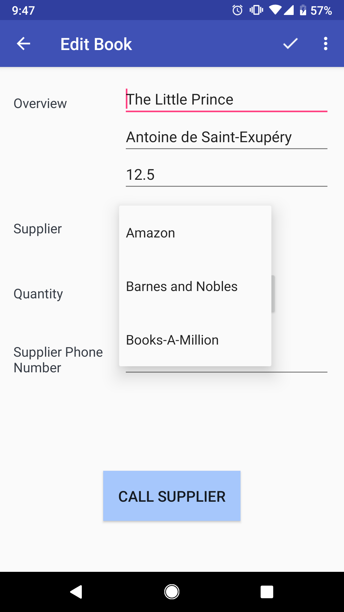
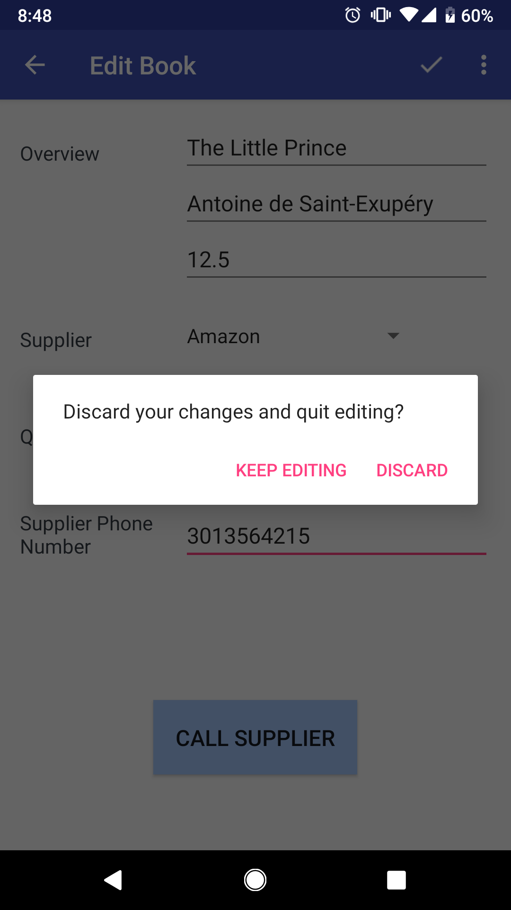

# BookInventory

<b> A multi-screen data storage app that allows a store to keep track of its inventory of books. The Book Inventory app stores information 
about the books, tracks sales and shipments, and makes it easy for the user to order more books from the listed suppliers. </b> 

 Project #7 for the <b>Android Basics Nanodegree</b> by Google 

 This app focuses on the importance of data persistence when building an Android app. I learned how to work with SQL databases and 
Content Providers, which helps keep data bug-free and allows me to share my data storage with other developers. To create the 
BookInventory app I defined and setup the database schema that can be used to keep track of the book inventory. The apps stores 
information about the book's title, author, price, quantity, supplier, and supplier's phone number. The app uses a ContentProvider
backed by a SQLite database. This ContentProvider is updated whenever changes are made to the database. 

 In the Main Activity, each list item displays the book's title, author, price, and quantity. The list item also contains 
a sale button that reduces the total quantity of that particular book by one. The Product Detail Layout displays the book name,
price, quantity, supplier name, and supplier's phone number. It also contains buttons to increase and decrease the available quantity
displayed. The user cannot enter negative quantities (zero is the lowest amount) and the app includes logic so that null values are not
accepted. If a null value is inputted, a toast message prompts the user to input the correct information before they can continue.
The Detail Layout contains a button for the user to contact the supplier via an intent to a phone app using the Supplier Phone Number
stored in the database. The Product Detail Layout contains a button to delete the product record entirely. When there is no information
to display in the database, the layout displays a TextView with instructions on how to populate the database. 

Core Concepts I learned Completing this Project:
----------------------------------------------
-	Creating a SQLite table in my app
-	Populating the table with new entries
-	Modifying the entries
-	Displaying the contents of the table to the users
-	Storing information in a SQLite database
-	Integrating the Android’s file storage systems into that database
-	Setting up a Content Provider and use it to access a repository of data
-	Presenting information from files and SQLite databases to users
-	Updating information based on user input
-	Creating intents to other apps using stored information 
-	Creating interactivity through button clicks and Java code.

 
 
 
